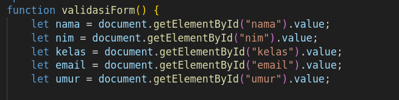
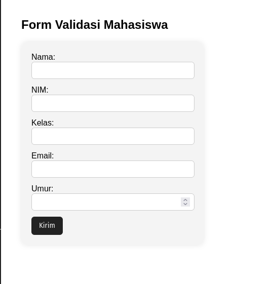

# Form dengan Validasi alert
## Penjelasan kode  :

---
### 1.HTML Form

---
### 2.Function JS

---
### 3. Alert Nama

---
### 4. Alert NIM

---
### 5. Alert Umur (Harus 18 tahun Keatas)

---
### 6. Menampilkan Semua data yang sudah masuk

---
# Hasil Tampilan Website 

---
### 1. Tampilan awal

---
### 2. Tampilan Form Terisi

---
### 3. Alert Bahwa data sudah terkirim

